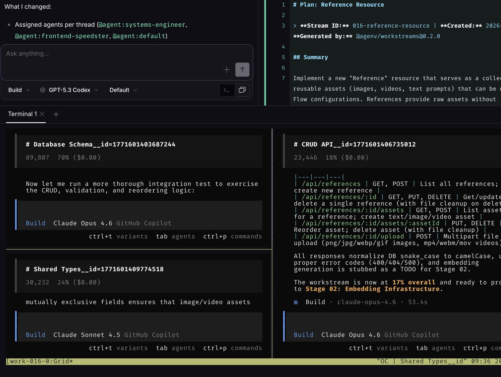

# AgEnv

AgEnv is a developer toolkit for planning, running, and reviewing agent-driven work efficiently. It provides structured workstreams for breaking work into stages/batches/threads, plus CLI workflows that integrate with Opencode so humans and agents can collaborate with clear progress and handoffs.

<p align="center">
  
</p>

## External Dependencies

Required:

- Bun
- Git

Feature-dependent:

- `opencode` CLI: required for `work execute`, `work multi`, and agent-run execution flows
- `tmux`: required for `work multi` session orchestration
- `ttyd`: required for local browser-embedded dashboard terminal views
- GitHub CLI (`gh`): required for GitHub integration flows (`work github`, issue/branch sync)
- macOS notification tools (`terminal-notifier`, `say`): optional, used by notification providers

## Packages

- `@agenv/workstreams`: workstream library + `work` CLI
- `@agenv/cli`: `ag` CLI wrapper
- `@agenv/workstream-dashboard`: local-only current-workstream dashboard server

## Repo Layout

```text
packages/        # TypeScript packages
agent/           # Skills, commands, tools, hooks
docs/            # Minimal operational docs
work/            # Workstream data in this repo
```

## Install (local development)

```bash
bun install
./install.sh
```

Optional skill install:

```bash
./install.sh --with-skills
./install.sh --skills-all
# Optional managed profile for Root Agent auto-launch tools/skill:
./install.sh --skills-all --profile managed
```

## Human Workflow (With Agent)

The day-to-day workflow is:

1. Discuss the feature and let the agent research the repo.
2. The agent uses `planning-work` to create the workstream, fill the root `README.md`, and prepare stage `REQUIREMENTS.md` / `PLAN.md` files plus any stage `specs/` content, including meaningful stage `PLAN.md` titles.
3. You approve the plan, which initializes canonical execution state directly from `PLAN.md` and generates per-thread `WORK.md` files.
4. You manually `/fork` the session and ask the forked session to supervise the approved work.
5. The supervision branch uses `supervising-work` to run `work supervise`, inspect persisted state, and drive the review/fix/escalation loop.
6. Implementation agents spawned within that loop use `implementing-work` to inspect batch/thread scope and update item state while they work.
7. The supervisor fork reports back; you approve the completed stage with `work approve stage N`.
8. Repeat the supervision loop for the next stage.
9. If more work is needed after the original stages, use the revision flow.
10. When the workstream is done, use `evaluating-work` to finalize `REPORT.md` and validate the report.

Draft-first planning usually starts like:

```bash
work create --name my-feature
work current --set "001-my-feature"
work validate requirements
work plan create --stages 2
work validate plan
work approve plan
```

Human approval / inspection commands typically look like:

```bash
work tree
work status
work approve plan
work approve stage 1
work report validate
```

Notes:

- Use `!work ...` when invoking from chat-driven Opencode commands.
- Agents handle most planning and execution details; humans control approvals, stage gates, and final evaluation.
- Manual `/fork` supervision is the default handoff model. The older Root Agent management launch flow remains available through the managed install profile.
- `work supervise` is the normal execution primitive; `work start` is no longer the main workflow entrypoint.
- The implementation agents running inside supervision commonly inspect scope with `work status`, `work tree --batch`, and `work list --thread` before updating thread/item state.

For supervised headless automation with review/fix/escalation policy, start with `docs/SUPERVISOR.md`; for quick validation drills and the optional tmux/tool E2E smoke test, use `docs/supervision-manual-verification-checklist.md`.

Example output from `work tree`:

```text
[ ] Workstream: 016-reference-resource (47)
├── [x] Stage 01: Foundation - Database, API & Types (8)
│   └── [x] Batch 01: Core Backend + Types (8)
│       ├── [x] Thread 01: Database Schema (3) @systems-engineer
│       ├── [x] Thread 02: CRUD API (3) @systems-engineer
│       └── [x] Thread 03: Shared Types (2) @default
├── [ ] Stage 02: Embedding Infrastructure (11)
│   ├── [ ] Batch 01: Python Embedding Service (6)
│   │   ├── [ ] Thread 01: Multimodal Embedding Service (3) @systems-engineer
│   │   └── [ ] Thread 02: Embedding API Endpoints (3) @systems-engineer
│   └── [ ] Batch 02: Re-indexing & Integration (5)
│       ├── [ ] Thread 01: Re-index Background Job (3) @systems-engineer
│       └── [ ] Thread 02: Upload-Triggered Embedding (2) @default
└── [ ] Stage 03: Frontend - Resource Management (8)
    └── [ ] Batch 01: API & Resource Definition (8)
        ├── [ ] Thread 01: Frontend API Client (2) @frontend-speedster
        ├── [ ] Thread 02: Resource Definition & Manager (3) @frontend-speedster
        └── [ ] Thread 03: Embedding Settings UI (3) @frontend-speedster
```

Example output from `work status`:

```text
+--------------------------------------------------+
| 016-npm-publish-cleanup                          |
| Status: [x] completed                            |
+--------------------------------------------------+
| Progress: [##############################] 100%  |
| Items: 22/22 complete, 0 in-progress, 0 blocked  |
+--------------------------------------------------+
| [x] Stage 01: Build System & Cleanup (15/15) ✓   |
| [x] Stage 02: Testing & Documentation (7/7) ✓    |
+--------------------------------------------------+
```


## Skills and Agent Roles

AgEnv uses skill files under `agent/skills/*` to guide agent behavior through each phase.

- `planning-work`: used first to create the stream, fill the root `README.md`, shape stage docs, and get the workstream ready for plan approval.
- `managing-work`: optional managed-profile skill used by the Root Agent after plan approval to launch and monitor a supervision branch automatically.
- `researching-work`: used when the user wants research/discovery before any staged planning begins.
- `supervising-work`: used by the supervision branch to run `work supervise`, inspect persisted state, and drive the review/fix/escalation loop.
- `implementing-work`: used by worker agents that execute thread items within supervised batches; these workers inspect their scope and keep item state current.
- `evaluating-work`: used near completion to assess delivered work and finalize report quality (`REPORT.md`).

In practice:

1. Planning agent uses planning skill to prepare the root `README.md` plus stage requirements, plan, and shared guidance.
2. Human approves (`work approve plan`).
3. Human manually `/fork`s the session and asks the forked session to supervise the work.
4. Supervision branch uses the supervising skill to run `work supervise` and make review/fix/escalation decisions.
5. Implementation agents use the implementation skill to work assigned threads and update item state.
6. Human approves each completed stage, and evaluation/reporting happens at the end.

## Custom Workstream Tools

Opencode custom tools support parts of the workstream workflow that need access to live session context.

- `workstream_link_planning_session`: links the current opencode session to a workstream as its planning session.
- `workstream_launch_supervision_branch`: optional managed-profile tool that launches the supervision branch from the Root Agent session.
- `reconcile_workstream_supervision`: reconciles stale ended-but-nonterminal supervision sessions.
- `link_thread_session`: used by implementation agents to link the current opencode session to their assigned thread before substantive implementation work begins.

## Test and Typecheck

```bash
bun run typecheck
bun run test
```

For package-local checks:

```bash
cd packages/workstreams
bun run typecheck
bun run test
```

## Docs

- `docs/INSTALL.md`
- `docs/WORKSTREAM.md`
- `docs/HOW_TO_USE_MULTI.md`
- `docs/SUPERVISOR.md`
- `docs/ROOT_AGENT_BRANCHING_ARCHITECTURE.md`
- `packages/dashboard-server/README.md`
- `docs/supervision-manual-verification-checklist.md`
- `docs/NOTIFICATIONS.md`
- `docs/workstream-reports.md`
- `docs/NPM_PUBLISHING.md`
